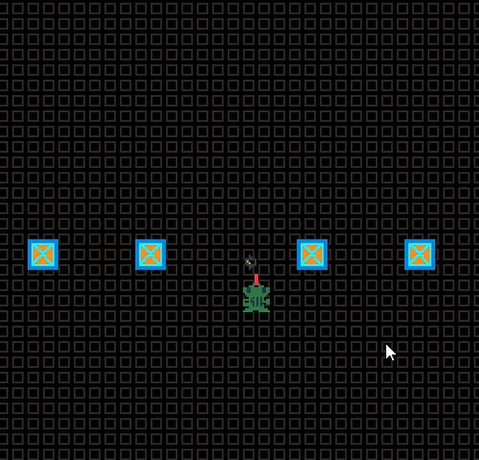

# Don't Get Frogie Fired

Author: Shangyi Zhu

Design: Frogie the Frog needs to pick out the bugs from the rest of the cargo, and he does it with his tongue

Screen Shot:

How Your Asset Pipeline Works:

This pipeline uses the PPU466 standard of 8 palettes, 256 tiles, and 64 sprites. 
For each PNG, the pipeline detects colors to build a color palette of 3 opaque colors and 1 transparent. Since there are animations of the same 
character with the same colors, it will reuse the color palette created at the first frame of the animation(The 0th png).
The pipeline only allows PNGs with width and height as multiples of 8, so that it can slice the PNG into 8*8 tiles to store in the tile table.
For example, the 16 * 16 frog in this game is sliced into 4 tiles, and later pieced backtogether to form the frog sprite.
The background is simply an 8 * 8 tile repeated across the entire screen of 60 * 64 tiles.

The source files are all located in the [link](assets) folder.
How To Play:

Use the space button to eat bugs from the conveyor belt, if you fail to do so, bad things happen.

This game was built with [NEST](NEST.md).

